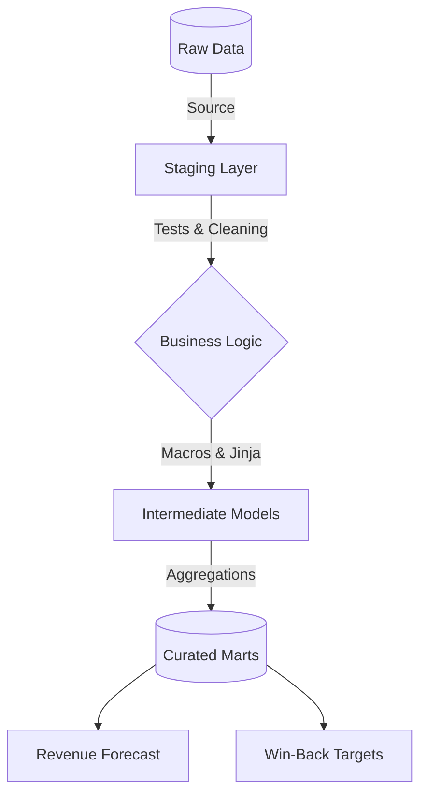

## 📊 SaaS Unit Economics & Modern Data Stack Migration

   

---
## 🎯 Executive Summary
**The Problem:** A legacy operational reporting system (Honda Dealership) was generating isolated SQL scripts, lacking version control, data quality tests, and scalability. Furthermore, "Ghost Users" (missing contact info) were causing an estimated **$79,830 USD** in annual revenue leakage.

**The Solution:** I migrated the ad-hoc SQL analysis into a robust **Modern Data Stack pipeline using dbt Core**. This transformation applies software engineering best practices to data, modeling physical service events into digital SaaS metrics (MRR, Churn, and LTV).

---

## 🏗️ Analytics Architecture (The dbt Pipeline)

This repository demonstrates the transition from isolated scripts to a production-grade DAG (Directed Acyclic Graph).

---
## 📂 Repository Structure

honda_saas_metrics/
│
├── models/
│   ├── staging/
│   ├── intermediate/
│   └── marts/
│
├── macros/
└── legacy_analysis/

---

## 🔄 The "Translator" Layer (SaaS Business Logic)
Translating physical operations into scalable SaaS metrics to drive Revenue Operations (RevOps).

| Operational Concept      | SaaS Equivalent        | Business Application                                   |
|--------------------------|------------------------|--------------------------------------------------------|
| Missing Phone Number     | Incomplete Profile     | Prevents re-engagement & increases Churn Risk          |
| Service Appointment      | Active User Session    | Measuring DAU/MAU (Engagement)                         |
| Morning vs. Afternoon    | Server Load            | Optimizing fixed costs during idle times               |
| Car Models               | Subscription Tiers     | Identifying High-LTV segments for upsell               |

---

## 💰 Strategic Output: Revenue Recovery Scenarios
The fct_revenue_leakage mart calculates recovery potential using a conservative $120 USD ARPU.

| Scenario      | Recovery Rate | Estimated Revenue Impact | Strategy Required                     |
|--------------|--------------|--------------------------|--------------------------------------|
| Pessimistic  | 5%           | $26,310                  | Passive Email Automation             |
| Realistic    | 15%          | $79,830                  | SMS + Dedicated CSM Outreach         |
| Optimistic   | 30%          | $157,860                 | Full Account Management Intervention |

---

## 🧠 Why This Architecture Matters (AE Perspective)
Incremental Processing: The MRR calculation (fct_mrr_churn.sql) uses dbt's incremental materialization, processing only new data to minimize cloud warehouse compute costs.

Automated Data Quality: The pipeline halts if operational hours are negative or IDs are duplicated, preventing flawed data from reaching financial dashboards.

DRY Code via Macros: Complex CASE WHEN logic for tier valuation is centralized in a Jinja macro, making future business rule changes instant across all downstream models.

---

Author: Alejandro Diaz | Analytics Engineer
"Bridging the gap between raw operational data and scalable financial strategy."